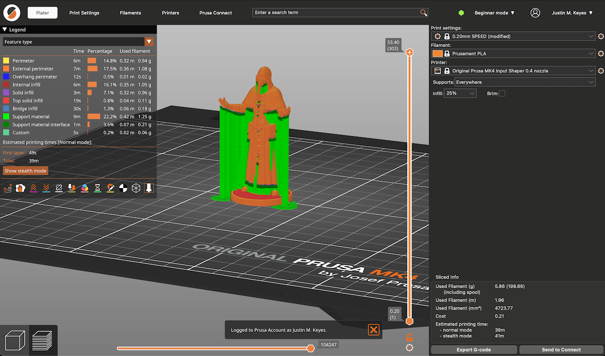

3d-printing self-replication programming electronics engineering

Basics
================================================================================
- Model downloads: https://www.printables.com/model
- Model formats: 3mf, stl, ...
- Convert to "g code" for instructing the printer.
- FDM (fused deposition modeling), aka FFF (fused filament fabrication https://en.wikipedia.org/wiki/Fused_filament_fabrication):
    - heated filament emitted by nozzle. ("if the machine has a nozzle, it's FDM/FFF")
    - common, cost-effective.
- SLA (Stereolithography https://en.wikipedia.org/wiki/Stereolithography)
    - works by layering "photos" of liquid layers together.
    - uses a UV light to cure liquid resin into hardened plastic.
    - requires extra steps after the print: washed, cured, dried.
    - more expensive, less common, but can yield more "perfect" results (useful for e.g. miniatures).
- 45 degrees is the most acute angle that can be reliably printed.
    - can be strengthened by changing the "infill".
- "quality" / granularity is determined by nozzle size (smaller = more granular).
- ⭐️ materials comparison table: https://help.prusa3d.com/materials

Workshop 2024
================================================================================
1. Download `SCP_049.3mf` from https://www.printables.com/model/111595-scp-049/comments
2. Drag it into PrusaSlicer.
    - 
3. Print settings: choose "0.2 mm".
    - Configures the nozzle size; affects granularity/quality/speed.
4. Filament: choose "Prusament PLA".
    - Must match the filament that you chose.
5. Infill: adjust this % to change the density of the model.
6. click "Slice now"
    - PrusaSlicer validates the model, suggest fixes, and generate a .stl file (`SCP_049.stl`).
7. click "Export G-code"
    - PrusaSlicer creates a .bgcode file (`SCP_049_0.4n_0.2mm_PLA_MK4IS_39m.bgcode`).
8. Send the g-code file to the printer (usb drive, etc).
9. Select the file in the printer. Don't remove the usb stick during printing, it can't be resumed!
10. Load the filament in the printer. Use the printer UI to take the filament
11. Start the print. Let it do its self-test routine. Wait for printing to complete.
12. After printing: cleanup! User the printer UI to detach the filament and perform a self-clean.

Vendors
================================================================================
- https://www.prusa3d.com/
    - open source, most popular, big ecosystem.
- https://www.formlabs.com/
    - proprietary
- https://www.reprap.org/
    - self-copying 3D printer (self-replicating machine).
